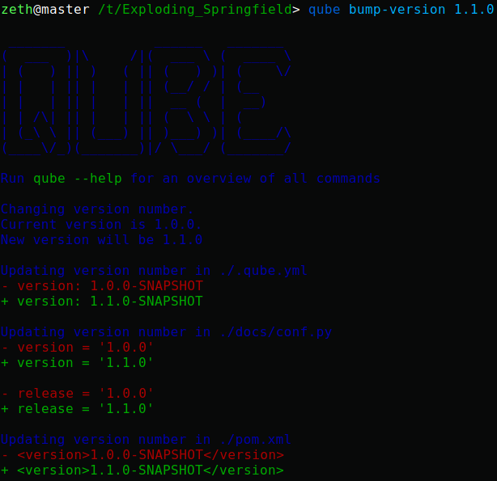

.. _bump-version:

==============================================
Bumping the version of an existing project
==============================================

| Increasing the version of an already existing project is often times a cumbersome and error prone process, since the version has to be changed in multiple places.
| To facilitate this process, QUBE provides a :code:`bump-version` command, which conveniently increases the version across several files.
| :code:`bump-version` also automatically creates a commit with only the changed files during :code:`bump-version`.

Usage
---------

The :code:`bump-version` command follows the syntax::

    qube bump-version X.X.X <PATH>

| where ``X`` corresponds to a numerical value of any range.
| The PATH corresponds to the path to the qube.cfg file, which contains all locations, where the version should be increased.

   bump-version applied to a fresh portlet-groovy project

.. _bump-version-configuration:

Configuration
------------------

| All templates of QUBE ship with a :code:`qube.cfg` file, which defines all files :code:`bump-version` examines.

The :code:`bump-version` configuration begins with the section::

    [bumpversion]
    current_version = 0.1.0

where the current version is defined. Afterwards, the whitelisted files are listed, e.g.::

    [bumpversion_files_whitelisted]
    dot_qube = .qube.yml
    conf_py = docs/conf.py

| All files, which are whitelisted are searched for patterns matching ``X.X.X``, which are updated to the specified new versions.
| Any lines, which contain the string :code:`<<QUBE_NO_BUMP>>` are ignored.

If files like Maven pom.xml files, contain many version patterns matching ``X.X.X``, it may be a better idea to blacklist them and enable only specific lines to be updated::

    [bumpversion_files_blacklisted]
    pom = pom.xml

Analogously to whitelisted files, which allow for specific lines to be ignored, blacklisted files allow for specific lines to be forcibly updated using the string :code:`<<QUBE_FORCE_BUMP>>`.
