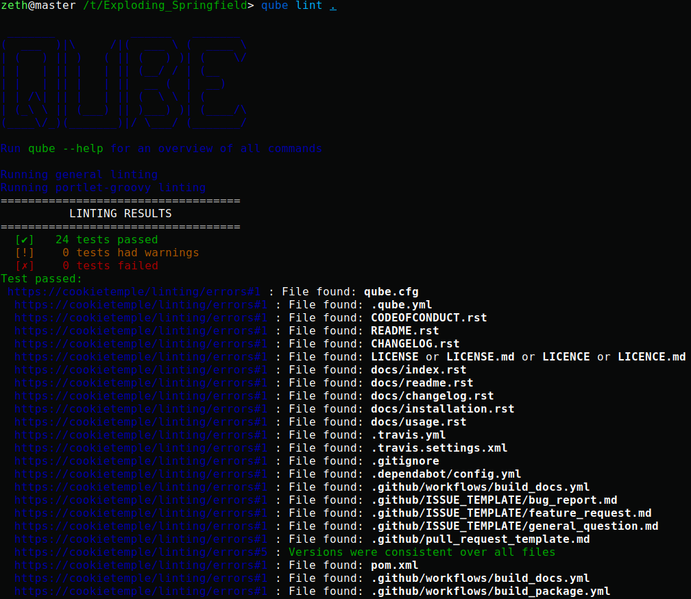

.. _lint:

=====================
Linting your project
=====================

| `Linting <https://en.wikipedia.org/wiki/Lint_(software)>`_ is the process of statically analyzing code to find code style violations and to detect errors.
| QUBE implements a custom linting system, but depending on the template external tools linting tools may be additionally be called.

QUBE linting
-----------------------

QUBE lint can be invoked on an existing project using::

    qube lint <OPTIONS> <PATH>

QUBE's linting is divided into three distinct phases.

1. All linting functions, which all templates share are called and the results are collected.
2. Template specific linting functions are invoked and the results are appended to the results of phase 1
3. Template specific external linters are called (e.g. checkstyle for Java based projects)

The linting results of the first two phases are assigned into 3 groups:

1. Passed
2. Passed with warning
3. Failed

If any of the checks failed linting stops and returns an error code.

   Linting applied to a newly created portlet-groovy project.

To examine the reason for a failed linting test please follow the URL. All reasons are explained in the section :ref:`Linting_codes`.

.. _linting_codes:

Linting Error Codes
--------------------------

The following error numbers correspond to errors found during linting.
If you are not sure why a specific linting error has occured you may find more information using the respective error code.

Error 1
~~~~~~~~~~

| File not found. This error occurs when your project does not include all of QUBE's files, which all templates share.
| Please create the file and populate it with appropriate values. You should also critically reflect why it is missing, since
  at the time of the project creation using QUBE this file should not have been missing!

Error 2
~~~~~~~~~

| Dockerfile invalid. *This check is currently disabled*. This error usually originates from empty Dockerfiles or missing FROM statements.

Error 3
~~~~~~~~~

| TODO String found. The origin of this error are ``QUBE TODO`` strings in the respective files. Usually, they point to things that should be
  manually configured or require other attention. You may remove them if there is no task for you to be solved.

Error 4
~~~~~~~~~

| Cookiecutter String found. This error occurs if something went wrong at the project creation stage. After a project has been created using QUBE
  there should not be any jinja2 syntax statements left. Web development templates may pose exceptions. However, ``{{ *cookiecutter* }}`` statements
  should definitely not be present anymore.

Error 5
~~~~~~~~~~

| Versions not consistent. If the version of all files specified in the [bumpversion] sections defined in the qube.cfg file are not consistent,
  this error may be found. Please ensure that the version is consistent! If you need to exclude specific lines from this check please consult :ref:`bump-version`.
  To prevent this error you should only increase the version of your project using :code:`qube bump-version`.

